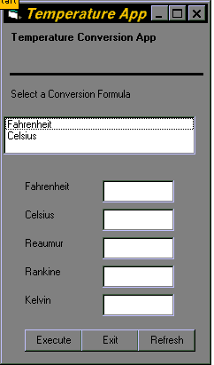



## Complete Temperature Conversion App \(using 4 formulas\)

### Description

Temp App using conversion to Rankine, Kelvine and Reaumur from a Celsius or Fahrenheit input from the user.
 
### More Info
 

             |
---                |---
**Submitted On**   |2004-01-21 02:21:20
**By**             |[Steven Jacobs](https://github.com/Planet-Source-Code/PSCIndex/blob/master/ByAuthor/steven-jacobs.md)
**Level**          |Intermediate
**User Rating**    |5.0 (10 globes from 2 users)
**Compatibility**  |VB 5\.0, VB 6\.0
**Category**       |[Complete Applications](https://github.com/Planet-Source-Code/PSCIndex/blob/master/ByCategory/complete-applications__1-27.md)
**World**          |[Visual Basic](https://github.com/Planet-Source-Code/PSCIndex/blob/master/ByWorld/visual-basic.md)
**Archive File**   |[Complete\_T1697571212004\.zip](https://github.com/Planet-Source-Code/steven-jacobs-complete-temperature-conversion-app-using-4-formulas__1-51151/archive/master.zip)

